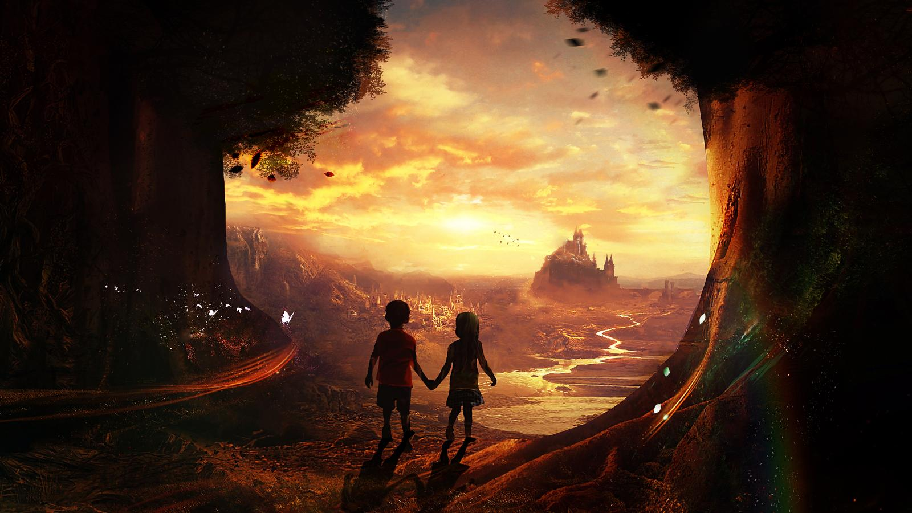

# ADD SOME MAGIC TO YOUR WEB PROJECT!
Unleash the power of the GPU! Use fancy-webgl-sparkles.js to spice up your website with this awesome webgl effect.

Please read the [documentation](/getting-started/introduction) to get started.

	

